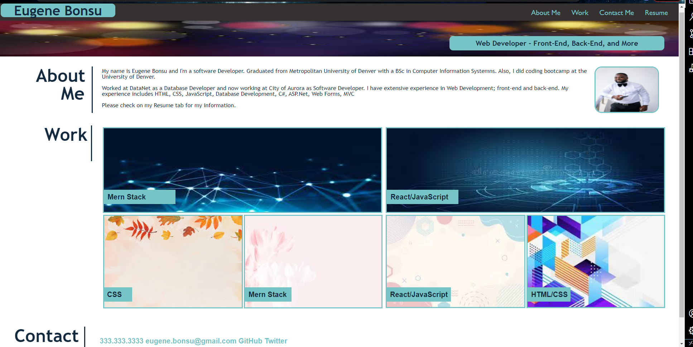

# Bonsu-Portfolio

## Professional Career Portfolio

This project is a brief explanation of my experience I have gained in my years of working in the IT industry. It is a placeholder where employers, family, friends, and peers not only find and appreciate my work but get first-hand information about my skillset. Most importantly, this project was built to showcase my experience to employers. 

## Usage

The following image demonstrates the web application's appearance and functionality:

* About Me: It gives a brief description of myself and my skill-set.

* Work: Images of my work in regards to my IT experience. 

* Contact Me: My contact information were people can reach me.

* Resume: My professional resume.

* When my picture is hovered at, it enlarges.

* When any of the four tabs/links on the right corner of the page is clicked it takes the user to its respective section. 

* When the images on the Work section is clicked it takes the user the said deployed application (Yet to be completed.)

* Below is a link to the deployed web application.

https://eugenestar5.github.io/bonsu-portfolio/